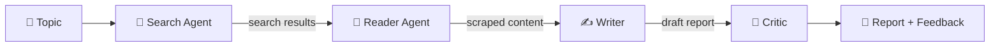

# 🔎 Multi-Agent Research System

An AI research team in a pipeline. Give it any topic, and four specialised agents **search the web, read the best source, write a structured report, and review their own work**.

Instead of one giant prompt doing everything, each agent has a single job, and the output of one becomes the input of the next.

---

## ✨ Features

- 🤖 **Four specialised agents** working together in a sequential pipeline
- 🌐 **Live web search** for recent and reliable information
- 📖 **Deep content scraping** of the most relevant source
- ✍️ **Structured report generation** from the collected research
- 🧐 **Built-in critic** that reviews the report and gives feedback
- 🖥️ **Two ways to run it**: an interactive web UI or the terminal
- 📥 **Downloadable report** in Markdown format

---

## 🧠 How It Works



| Step | Agent | What it does |
|------|-------|--------------|
| 1 | **Search Agent** | Finds recent, reliable and detailed information about the topic |
| 2 | **Reader Agent** | Picks the most relevant URL from the search results and scrapes it for deeper content |
| 3 | **Writer** | Combines the search results and scraped content into a structured report |
| 4 | **Critic** | Reviews the final report and returns feedback on how to improve it |

---

## 🛠️ Tech Stack

- **Python 3.10+**
- **LangChain / LangGraph** for agents and chains
- **Streamlit** for the web interface
- **python-dotenv** for managing API keys

---

## 📁 Project Structure

```
Multi Agent System/
├── agents.py          # Search agent, reader agent, writer chain, critic chain
├── tools.py           # Tools used by the agents (web search, scraping)
├── pipeline.py        # Runs the full research pipeline in the terminal
├── app.py             # Streamlit web UI
├── requirements.txt   # Python dependencies
└── .env               # API keys (never commit this file)
```

---

## 🚀 Getting Started

### 1. Clone the repository

```bash
git clone https://github.com/<your-username>/<your-repo-name>.git
cd "<your-repo-name>/Multi Agent System"
```

### 2. Create and activate a virtual environment

```bash
python -m venv .venv

# Windows
.venv\Scripts\activate

# macOS / Linux
source .venv/bin/activate
```

### 3. Install dependencies

```bash
pip install -r requirements.txt
pip install streamlit
```

### 4. Set up your API keys

Create a `.env` file and add the keys your project uses:

```env
# Example - replace with the keys your agents/tools actually need
LLM_API_KEY=your_llm_api_key_here
SEARCH_API_KEY=your_search_api_key_here
```

> ⚠️ Never commit your `.env` file. Add it to `.gitignore`.

---

## ▶️ Usage

### Option A: Web UI (recommended)

```bash
streamlit run app.py
```

Then open the local URL shown in your terminal (usually `http://localhost:8501`), enter a topic, and click **Run research**. You'll see each agent's progress live, and the result appears in three tabs:

- **Report**: the final report, with a download button
- **Critic feedback**: the critic's review
- **Sources & raw research**: search results and scraped content

### Option B: Terminal

```bash
python pipeline.py
```

Enter a research topic when prompted. Every step is printed in the terminal.

---

## 💡 Example Topics

- Impact of generative AI on software jobs
- Latest breakthroughs in solid-state batteries
- How does India's UPI compare to other payment systems?

---

## 🔮 Future Improvements

- [ ] Scrape multiple sources instead of one
- [ ] Add a source verification / fact-checking agent
- [ ] Loop the writer and critic until the report meets a quality bar
- [ ] Add memory so agents can build on earlier research
- [ ] Export reports as PDF or Word documents
- [ ] Stream agent output token by token in the UI

---

## 🤝 Contributing

Contributions, ideas and suggestions are welcome. Feel free to open an issue or submit a pull request.

---

## 📜 License

This project is licensed under the MIT License. See the `LICENSE` file for details.

---

## 👤 Author

Ranveer Sachin Deshmukh
🔗 [LinkedIn] - https://www.linkedin.com/in/ranveer-deshmukh-b91b25302/

⭐ If you found this project useful, consider giving it a star!
